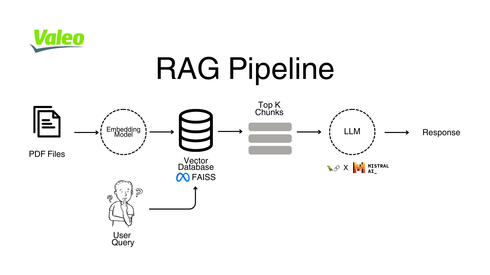
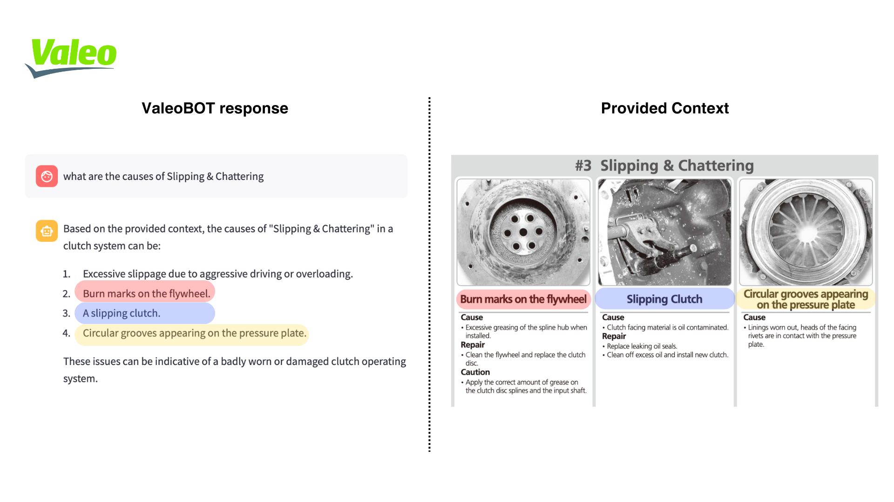
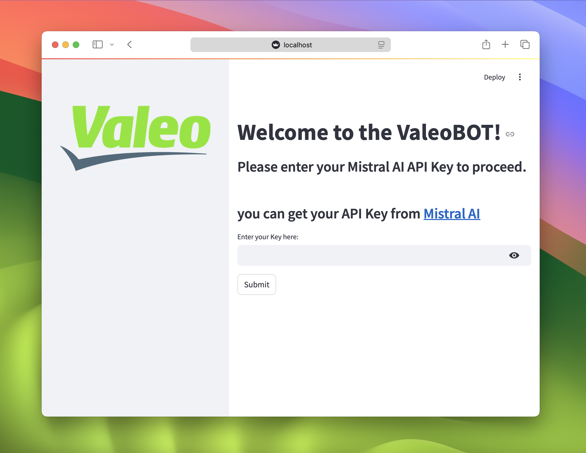
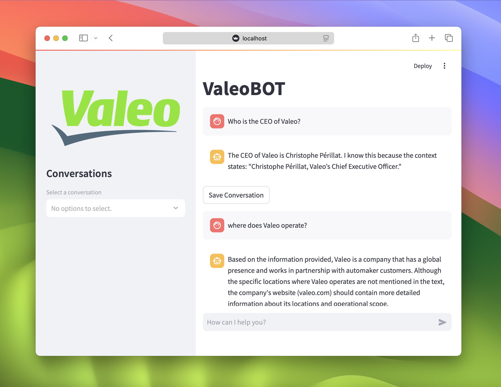

# $${\textcolor{limegreen}{ValeoBOT}}$$ 
ValeoBOT is a Streamlit-based chatbot application designed to interact with users and provide intelligent responses using language models. The application supports Retrieval augmented generation and Q&A functionality powered by LangChain, FAISS, and HuggingFace embeddings.

Available preview hosted at: [https://valeobot.streamlit.app](https://valeobot.streamlit.app) 

> [!TIP]
> It might take a while for it to launch because of the size of the provided context

> ✨ README Français: [README_French.md](https://github.com/rayaneghilene/ValeoBOT/blob/main/README_French.md)

# Table of Contents


1. [RAG Pipeline](#rag-pipeline)
2. [Features](#features)
3. [Installation](#installation)
4. [Usage Guide](#usage-guide)
    - [Landing Page](#landing-page)
    - [Chat Page](#chat-page)
    - [Document Retrieval](#document-retrieval)
5. [File Structure](#file-structure)
6. [Technologies Used](#technologies-used)
7. [Notes](#notes)
8. [Support](#support)


## RAG Pipeline

Retrieval-Augmented Generation (RAG) is a text generartion pipelinr that enhances the chatbot's ability to generate more accurate responses by first retrieving relevant information from a document store (in this case, PDFs stored in `/data`) and then using this context to generate a response. This method helps the chatbot answer specific questions with relevant data.




The pdf files in `\Data` are embedded using the `all-MiniLM-L12-V2` model from HuggingFace, the embeddings are then stored in the [FAISS](https://github.com/facebookresearch/faiss) Vectorstore. 

When the user submits a query, the chatbot performs a similarity search to find the most relevant text chunks and uses them as context for generating a response. 





## Features

- **Landing Page:** Secure API key entry to authenticate users.
- **Chat Interface:** Interactive chat with conversation history management.
- **Document Retrieval:** Automatically loads and indexes PDF files for question-answering capabilities.
- **Conversation Management:** Save and view previous conversations.


## Installation

1. Clone the repository:

    ```bash
    git clone https://github.com/rayaneghilene/ValeoBOT.git
    cd ValeoBOT
    ```

2. Build the project:
    ```ruby
    docker build -t valeobot .
    ```

3. Run the container:
    ```ruby
    docker run -p 8501:8501 valeobot
    ```


> [!NOTE]  
> If not automatically lanuched, open your web browser and navigate to the URL provided by Streamlit [http://localhost:8501](http://localhost:8501).


## Usage guide

1. **Landing Page:**

- Enter your Mistral AI API key and click "Submit" to proceed.




- Note: If not redirected instantly to the chat interface, press again on the submit button.


2. **Chat Page:**
   - Interact with the chatbot by entering your queries in the chat input.
   - Save conversations for future reference using the "Save Conversation" button.





3. **Document Retrieval:**
   - The chatbot can answer questions based on the content of the PDF files in the `Data/` folder. The data is collected from `https://www.daitomoparts.com › catalogos › Valeo` and it is constituted of a valeo component catalog.


## File Structure

```
.
├── Data/                  # Directory for storing PDF files
├── Images/                # Directory for storing images
├── conversations.json     # File for saving conversation history
├── app.py                 # Main application script
├── requirements.txt       # Python dependencies
├── README.md              # Project documentation
└── README_French.md       # French Project documentation
```

## Technologies Used

- **Streamlit:** Interactive UI for the chatbot.
- **LangChain:** Document loading, text splitting, and retrieval QA.
- **FAISS:** Vector store for efficient similarity search.
- **HuggingFace:** Embedding model for document indexing.
- **MistralAI/Ollama:** Language models for generating responses.

## Notes
- The application is designed to handle large PDF datasets; however, performance depends on system resources.
- Streamlit buttons trigger an action when clicked, but the state might not update immediately, which can cause the need to click twice.


##  Support

Please reach out to rayane.ghilene@ensea.fr for any questions, issues, or feedback :)