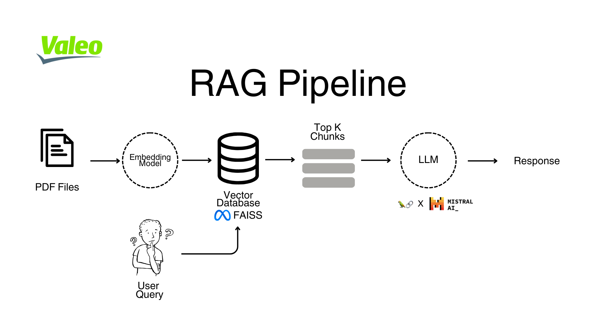

# $${\textcolor{limegreen}{ValeoBOT}}$$
### *Version française -- Traduite par ChatGPT*


ValeoBOT est une application de chatbot basée sur Streamlit, conçue pour interagir avec les utilisateurs et fournir des réponses intelligentes en utilisant des modèles de langage. L'application prend en charge la génération augmentée par récupération (RAG) et la fonctionnalité de questions-réponses alimentée par LangChain, FAISS et les embeddings de HuggingFace.

Aperçu disponible hébergé à : [https://valeobot.streamlit.app](https://valeobot.streamlit.app)  

> [!TIP]
> Cela peut prendre un certain temps pour se lancer en raison de la taille du contexte fourni

# Table des matières

1. [Pipeline RAG](#pipeline-rag)
2. [Fonctionnalités](#fonctionnalités)
3. [Installation](#installation)
4. [Usage Guide](#guide-dutilisation)
    - [Page d'atterrissage](#Page-datterrissage)
    - [Page de chat](#Page-de-chat)
    - [Document Retrieval:](#document-retrieval)
5. [structure des fichiers](#structure-des-fichiers)
6. [Technologies utilisées](#technologies-utilisées)
7. [Remarques](#remarques)
8. [Support](#support)

## Pipeline RAG 

La génération augmentée par récupération (RAG) est un pipeline de génération de texte qui améliore la capacité du chatbot à générer des réponses plus précises en récupérant d'abord des informations pertinentes à partir d'un magasin de documents (dans ce cas, des PDF stockés dans `/data`) puis en utilisant ce contexte pour générer une réponse. Cette méthode aide le chatbot à répondre à des questions spécifiques avec des données pertinentes.



Les fichiers PDF dans `\Data` sont intégrés à l'aide du modèle `all-MiniLM-L12-V2` de HuggingFace, les embeddings sont ensuite stockés dans le Vectorstore [FAISS](https://github.com/facebookresearch/faiss).

Lorsque l'utilisateur soumet une requête, le chatbot effectue une recherche de similarité pour trouver les morceaux de texte les plus pertinents et les utilise comme contexte pour générer une réponse.


## Fonctionnalités

- **Page d'atterrissage :** Entrée sécurisée de la clé API pour authentifier les utilisateurs.
- **Interface de chat :** Chat interactif avec gestion de l'historique des conversations.
- **Récupération de documents :** Chargement et indexation automatiques des fichiers PDF pour la fonctionnalité de questions-réponses.
- **Gestion des conversations :** Sauvegarde et consultation des conversations précédentes.


## Installation

1. Clonez le dépôt :

    ```bash
    git clone https://github.com/rayaneghilene/ValeoBOT.git
    cd ValeoBOT
    ```

2. Construisez le projet :
    ```ruby
    docker build -t valeobot .
    ```

3. Exécutez le conteneur :
    ```ruby
    docker run -p 8501:8501 valeobot
    ```


> [!NOTE]  
> Si l'application ne se lance pas automatiquement, ouvrez votre navigateur et accédez à l'URL fournie par Streamlit [http://localhost:8501](http://localhost:8501).

## Guide d'utilisation

1. **Page d'atterrissage :**

    - Entrez votre clé API Mistral AI et cliquez sur "Submit" pour continuer.


- Remarque : Si vous n'êtes pas redirigé immédiatement vers l'interface de chat, cliquez à nouveau sur le bouton "Submit".


2. **Page de chat :**
    - Interagissez avec le chatbot en saisissant vos requêtes dans le champ de chat.
    - Sauvegardez les conversations pour référence future à l'aide du bouton "Save Conversation".


3. **Document Retrieval:**
    - Le chatbot peut répondre aux questions en fonction du contenu des fichiers PDF dans le dossier `Data/`.

## Structure des fichiers

```
.
├── Data/                  # Répertoire pour stocker les fichiers PDF
├── Images/                # Répertoire pour stocker les images
├── conversations.json     # Fichier pour sauvegarder l'historique des conversations
├── app.py                 # Script principal de l'application
├── requirements.txt       # Dépendances Python
├── README.md              # Documentation du projet
└── README_French.md       # Documentation du projet en français

```

## Technologies utilisées
- **Streamlit :**  Interface utilisateur interactive pour le chatbot.
- **LangChain :** Chargement de documents, découpage de texte et récupération QA.
- **FAISS :** Vectorstore pour une recherche de similarité efficace.
- **HuggingFace :** Modèle d'embedding pour l'indexation des documents.
- **MistralAI/Ollama :** Modèles de langage pour générer des réponses.


## Remarques
- L'application est conçue pour gérer de grands ensembles de données PDF ; cependant, les performances dépendent des ressources système.
- Les boutons Streamlit déclenchent une action lorsqu'ils sont cliqués, mais l'état peut ne pas se mettre à jour immédiatement, ce qui peut nécessiter un double-clic.

##  Support

Veuillez contacter rayane.ghilene@ensea.fr pour toute question, problème ou retour :)